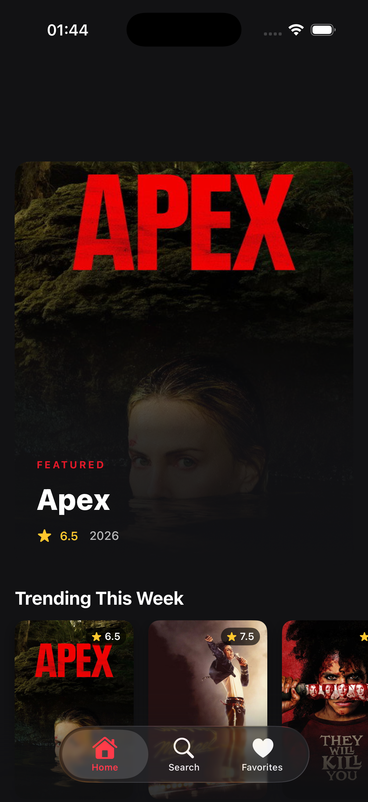
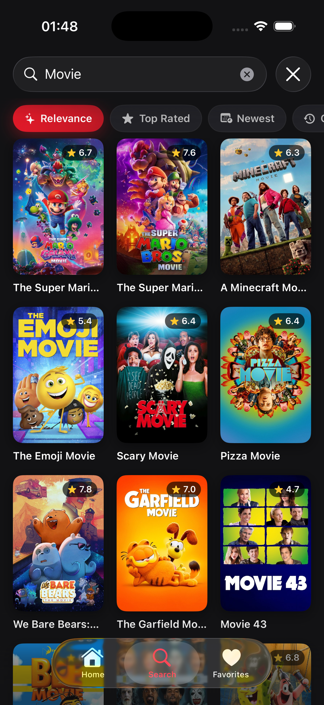
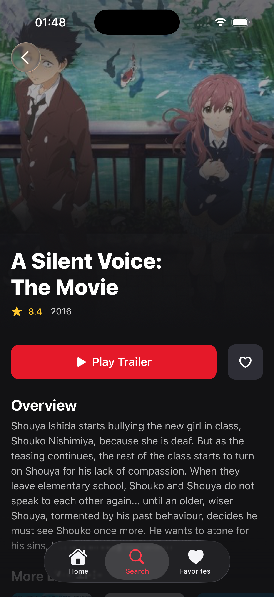
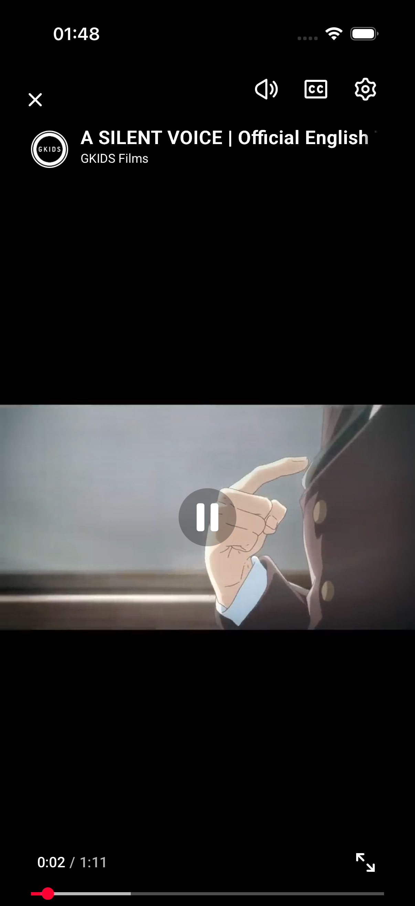
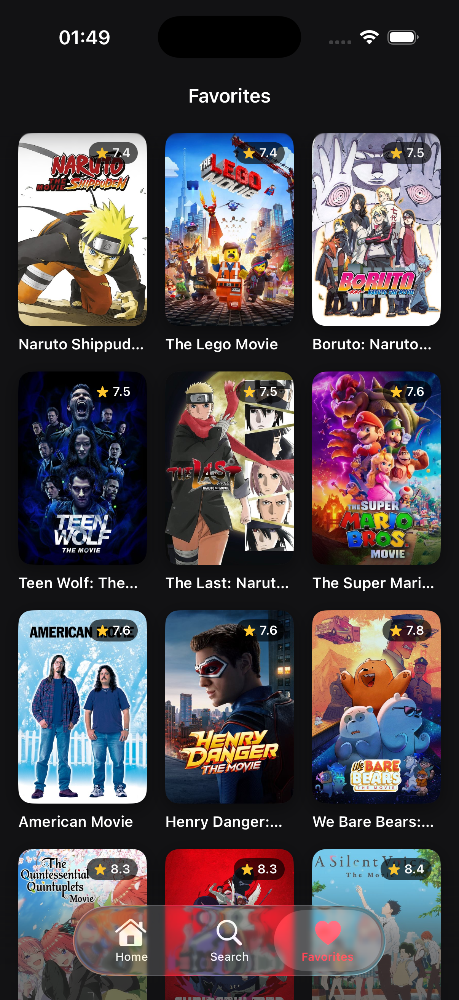

# Cineflix

A Netflix-style movie browsing iOS app built with SwiftUI and powered by [TMDB](https://www.themoviedb.org/).

## Screenshots

| Home | Search | Movie Details | Trailer Player | Favorites |
| :---: | :---: | :---: | :---: | :---: |
|  |  |  |  |  |

## Architecture

**MVVM + Coordinator (Router)**

- **Views** — Pure SwiftUI, no business logic. Receive a `ViewModel` via `@StateObject`.
- **ViewModels** — `ObservableObject` with `@Published` state. Handle loading / success / error / empty.
- **Router (`AppRouter`)** — Owns `NavigationPath` per tab and an `AppRoute` enum. Views never push destinations directly; they call `router.push(.movieDetails(movie))`.
- **DI Container (`DIContainer`)** — Single source of services injected through `@Environment(\.di)`. Easy to swap for tests.
- **Services are protocols** — `NetworkServiceProtocol`, `MovieServiceProtocol`, `ImageLoaderProtocol`, `RecentlyViewedServiceProtocol`. Mocks live in the test target.

```
Cineflix/
├── App/        # Entry point, Router, DI
├── Core/       # Networking, Services, Cache, Models, Logging
├── Features/   # Home, Search, MovieDetails, Trailer, Favorites
└── UI/         # DesignSystem + reusable components
```

## Features

- **Home** — Trending / Popular / Top Rated horizontal rails with infinite scroll and a featured hero card.
- **Search** — Debounced (300 ms via Combine), de-duped, paginated grid with skeletons + empty/error states.
- **Movie Details** — Backdrop with gradient, rating, overview, similar movies, favorite toggle, trailer playback.
- **Trailer Player** — `WKWebView` embedding `youtube.com/embed/{key}`, full-screen modal, loading + error handling.
- **Favorites** — Persisted with **SwiftData** (`@Model FavoriteMovie`), grid view with context-menu remove.
- **Offline-friendly cache** — In-memory page cache that returns stale data when the network fails.
- **Image loader** — Actor-based loader with in-flight de-duplication, memory + URLCache backing.
- **Pull-to-refresh** everywhere it makes sense.
- **Design system** — Centralized colors, spacing, radii, typography, dark theme tuned for cinema vibes.

## Tech Stack

- **SwiftUI** + `NavigationStack` / `NavigationPath`
- **Swift Concurrency** (`async`/`await`, actors, `Task` cancellation on view disappear)
- **Combine** for the debounced search pipeline
- **SwiftData** for favorites persistence
- **WebKit** for trailer playback
- **OSLog** for structured logging
- **Swift Testing** for unit tests with protocol-based mocks
- iOS 18+

## Testing

`CineflixTests/` contains unit tests for `HomeViewModel` and `SearchViewModel` using `MockMovieService` (protocol-based DI). Run with ⌘U.

## Configuration

Set the TMDB v4 bearer token via `EXPO_PUBLIC_TMDB_BEARER_TOKEN`. It is exposed to Swift through the auto-generated `Config.swift`.

## Screenshots

_Add screenshots of Home, Search, Details, Trailer, and Favorites here._
